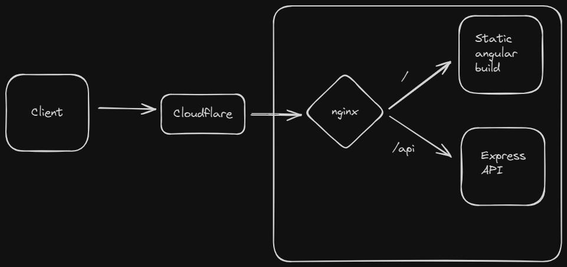

## Introduction

So let's begin.
I have always been more of a development focused guy and since most of my web applications were built using [Next.js](https://nextjs.org/) , I have never paid any special attention to the server side of things or building deployment infrastructure and DevOps side of things.

But one fine morning, I got a request from one of my clients that there is an idle machine which has 32 GB of RAM and an i5 processor (8 cores), and he wishes to shift his web applications from [Azure](https://azure.microsoft.com/) Virtual Machine to this machine.

I inquired more about the applications and came out with the following findings:

-   The frontend was built using [Angular](https://angular.io/), with its code on [Github](https://github.com/).
-   The backend API was built using [Express](https://expressjs.com/), with its code on [Github](https://github.com/).
-   The database being used was [PostgreSQL](https://www.postgresql.org/).
-   Backend API also required a set of environment variables to be set in the `.env` file.

I agreed to do the migration, but had no clue as I had not done anything practical in DevOps up until now. Still I asked him why is he doing it?
His answer was that since the application was stillin early stages and doesnot have much traffic, it was simply foolish to burn money by renting a VM from cloud providers when you have a spare and fairly high powered machine at home.

## The Plan

So I began looking up that how this can be done. First place where I looked for answer was [Chatgpt](https://chat.openai.com/). It gave me a fairly well planned approach that I can use to get the work done.

I will try to describe the approach in detail. So, basically the core idea was to do Reverse-proxying using [nginx](https://nginx.org/) server and route the requests to the angular app and the backend API.

### what is Reverse-proxying?

If the url is `https://www.king-kohli.com/`, then the nginx will send the requests to the backend API at `https://www.king-kohli.com/api` and the angular app at `https://www.king-kohli.com/`.

The following image will make it more clear to you:

<p align="center"></p>

So, I started to modify the existing settings on the remote machine. Here is the conclusive list of changes that were made:

1. Create a new file by the name of the domain in the folder `/etc/nginx/sites-available/` and created a new set of configurations which involved location where SSL certificates are located, and where the incoming requests are to be routed based on the URL.

```
    location / {
        proxy_pass ---location where the static build is stored---;  # Forward requests to production build of Angular app
        proxy_set_header Host $host;
        proxy_set_header X-Real-IP $remote_addr;
        proxy_set_header X-Forwarded-For $proxy_add_x_forwarded_for;
        proxy_set_header X-Forwarded-Proto $scheme;
    }

    location /api {
        proxy_pass http://localhost:3000;  # Forward to Express app on localhost:3000
        proxy_http_version 1.1;
        proxy_set_header Upgrade $http_upgrade;
        proxy_set_header Connection 'upgrade';
        proxy_set_header Host $host;
        proxy_set_header X-Real-IP $remote_addr;
        proxy_set_header X-Forwarded-For $proxy_add_x_forwarded_for;
        proxy_set_header X-Forwarded-Proto $scheme;
        proxy_cache_bypass $http_upgrade;
    }
```

2. Create a new file by the name of the domain in the folder `/etc/nginx/sites-enabled/` and create a symbolic link to the file created in `/etc/nginx/sites-available/`. For that I ran the following commands:

```bash
    # Step 1: Enable the site by linking to sites-enabled
    sudo ln -s /etc/nginx/sites-available/king-kohli.com /etc/nginx/sites-enabled/

    # Step 2: Test Nginx and reload
    sudo nginx -t
    sudo systemctl reload nginx
```

Other hacking that was required to fully setup the deployment:

1. Install `nvm` to manage Node.js versions.
2. Install Node.js LTS using `nvm`.
3. Install `pm2` process manager globally by using the following command:

```bash
    npm install -g pm2
```

4. Clone the FE abd BE from there respective github repositories.
5. Run `ng build --configuration=production` to build the production build of the Angular app.
6. Then I ran the following commands to set up the backend API:

```bash
    cd backend

    # Install dependencies
    npm ci --omit=dev && npm cache clean --force

    # Start the backend server using pm2
    pm2-runtime start src/app.js --name backend-api

```

Initially I had forgot to provide the `.env` file to the backend API. So I stopped the server and restarted the server after creating an `.env` file and populating it with the required environment variables.

Finally it was the moment of truth, and I opened the required domain in an incognito tab and it worked!

<p align="center">
    
</p>

I completed the other formalities like creating a proper folder structure for the same, and documentation about the entire infrastructure so that in future if someone has to work on this project, it would be easy to understand.
Honestly speaking it was an eye opening experience for me as it was the first time I was working with remote server without using any GUI. Secondly it taught me how `nginx` works and how to use it to setup a reverse-proxying.
This was my experience thanks for reading. I hope you enjoyed it.
Stay tuned for more of my thoughts and DevOps stories.
